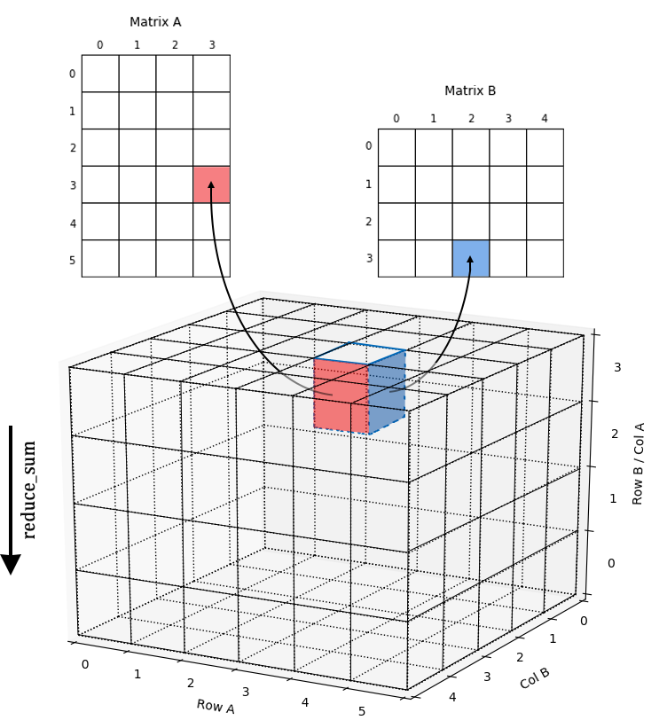
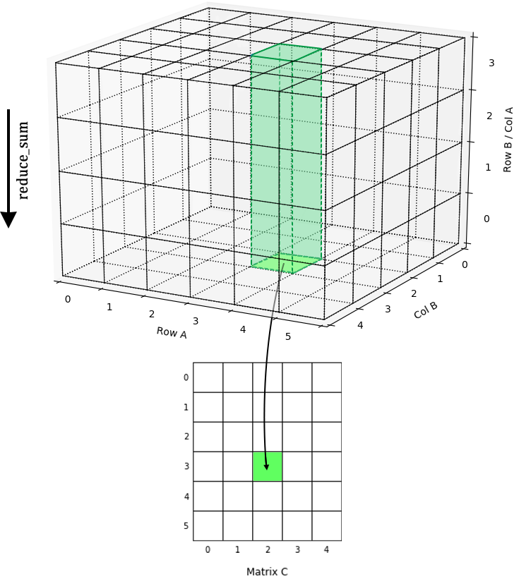
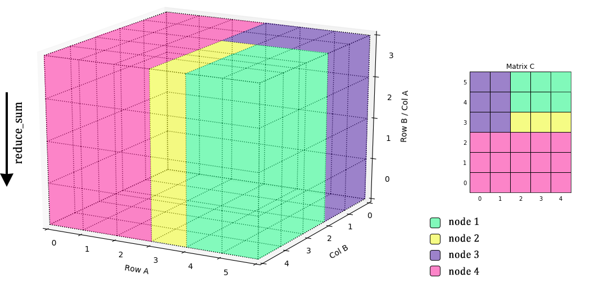
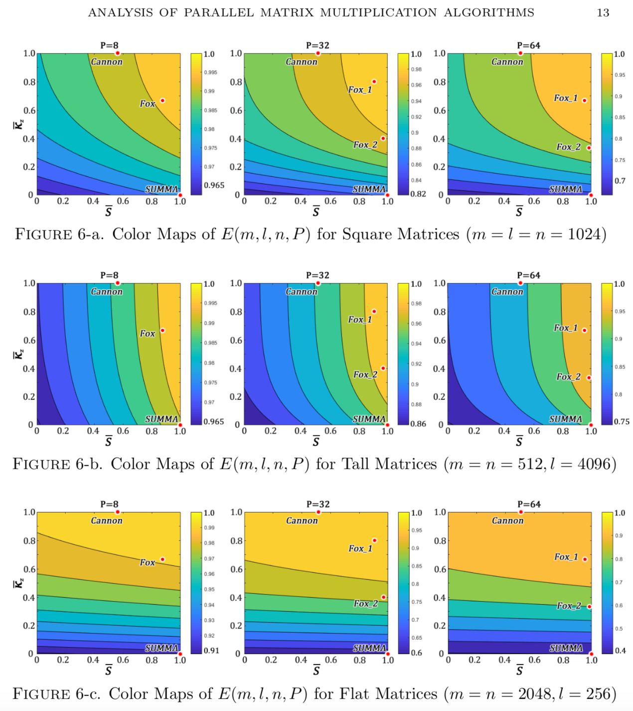
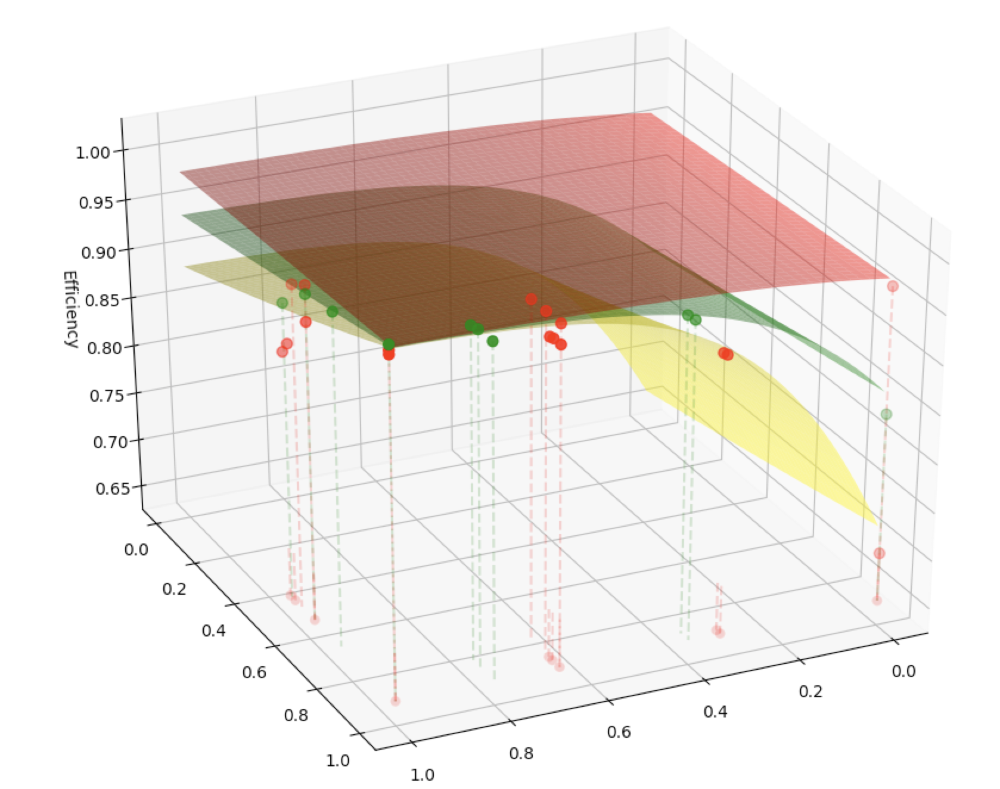

  

      <ul class="nav">
          <li><a href="">Analysis Of Parallel Matrix Multiplication Algorithms</a></li>
      </ul>
  

#### Analysis Of Parallel Matrix Multiplication Algorithms

The High-performance computing (HPC) algorithms for linear algebra are critical for many applications. matrix multiplication is at the core of many linear algebra problems. Therefore, it is very valuable for us to study Parallel Matrix Multiplication (PMM) and contribute to reduce inter-cores communication cost for improving the efficiency.

#### 3D Cube

Instead of study the PMM algorithms' process in a 2D plane, it is more easy and visualize to think it in a 3D cube.

In the 3D cube, the matrix multiplication process is to multiply the value stored in two surfaces of little cube then store the result in the upper surface. In the end, we need do the reduction to sum all result by the Z-axis.

#### PMM Blocks

The existing practical O(n3) PMM algorithms such as Cannon's, SUMMA, and PUMMA, etc have been designed to deal with various general conditions. Applying to the 3D cube, the algorithms' process are different by how they cut the blocks to save the data.

Due to the different way to cut the cube, the efficiency of each algorithms are depend on the shape of the Matrix cube.

#### Algrithom Families' Space and BUMMA

However, the existing practical PMM algorithms are not optimized, it is desirable to design a map for organizing the families of these PMM algorithms. Using the metric of parallel efficiency of the lattice, we evaluate the upper bounds of the algorithms as a function of the given dimensions of the matrices involved and the computer system parameters.

A new PMM algorithms (BUMMA) we design is to introduce the adaptivities to traditional PMM algorithms for handling different practical cases including the varying dimensions of matrices, number of computer nodes, buffer sizes, etc.

Figure 1: Heat map of Global Cancer Map (GCM) sample expression levels generated from Wavelet Thresholding method for genes/features selection.
Figure 2: Heat map of Global Cancer Map (GCM) sample expression levels generated from Differentially Expressed method for genes/features selection.
