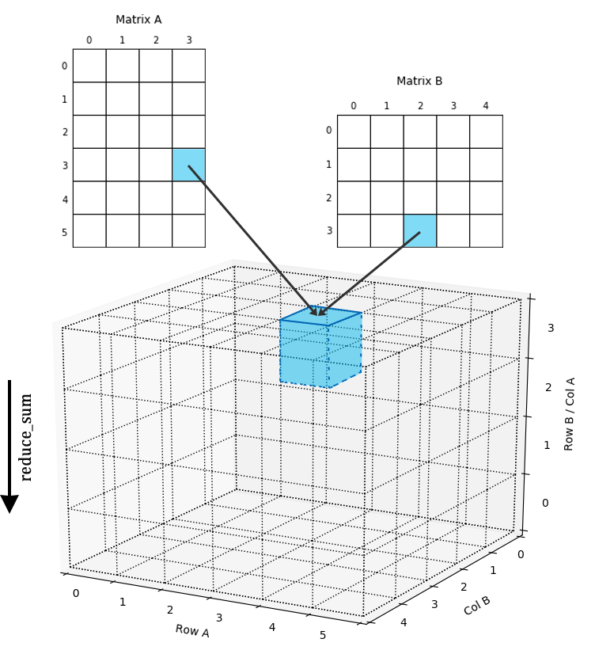

<!--

  

      <ul class="nav">
          <li><a href="nba1.html">prev</a></li>
          <li><a href="nba2.html">next</a></li>
      </ul>
  

--->

Back to my senior year in my undergraduate, I attended professor Deng's group and assisted to do research about parallel computing project. Currently as the second author working on paper deft proposed an algorithmic group that covers Cannon’s, BMR, SUMMA, distributed Strassen’s method for scalable parallel large-scale matrix multiplications. In addition, we generated generate a function which aims to collect the existing method and predict the future parallel matrix multiplications’ methods.

Figure 1: Heat map of Global Cancer Map (GCM) sample expression levels generated from Wavelet Thresholding method for genes/features selection.
Figure 2: Heat map of Global Cancer Map (GCM) sample expression levels generated from Differentially Expressed method for genes/features selection.
