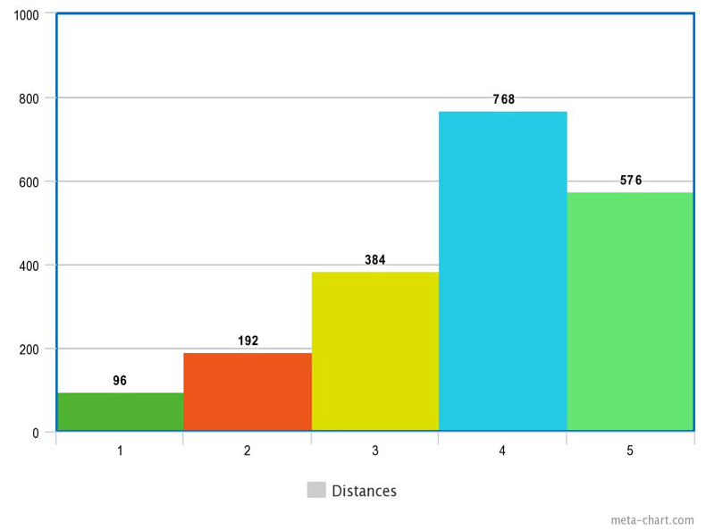

<!---

  

      <ul class="nav">
          <li><a href="">prev</a></li>
          <li><a href="nba2.html">next</a></li>
      </ul>
  

[Cloud Scale Genomic Signals Processing](https://ieeexplore.ieee.org/document/7317496/), a methodology for the anlysis of large-scale cancer genomic data using signal processing;  
see B. S. Harvey and S. Ji, "Cloud-Scale Genomic Signals Processing for Robust Large-Scale Cancer Genomic Microarray Data Analysis," in IEEE Journal of Biomedical and Health Informatics, vol. 21, no. 1, pp. 238-245, Jan. 2017.

Figure 1: Heat map of Global Cancer Map (GCM) sample expression levels generated from Wavelet Thresholding method for genes/features selection.
Figure 2: Heat map of Global Cancer Map (GCM) sample expression levels generated from Differentially Expressed method for genes/features selection.
-->
#### Optimal Topologies Searching Research

Greating aaa

