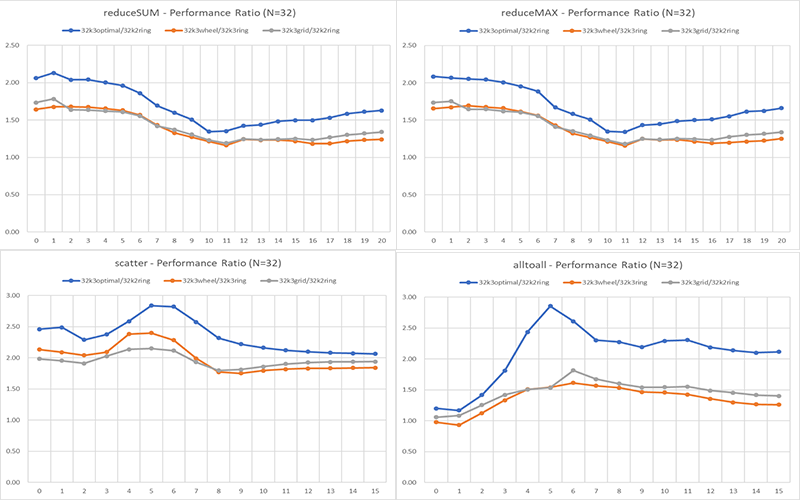

## Optimal Topologies Searching Research

It is very necessary to apply a good topologies in High-Performing Computer or cloud computing for reducing inter-cores' communicational cost and improving the performance. When I joined the optimal topologies searching guided by Prof. Yuefan Deng, I am very exciting to test the performance of the 32K3 Optimal Topology in Taishan Clusters. Also, I devoted a lot efforts in designed an algorithm to find the optimal 64K3 topologies.  

###MPI Collective Communication Tests On Taishan Cluster

I designed an algorithm which includes seven MPI collective communication methods. I applied the test algorithm in four topologies: 32K2 Ring, 32K3 Wheel and 32K grid. Because of 32K2 Ring is most inefficiency but the most common used topology in real industry, I normalized the experimental results by dividing the speed of 32K2 for the better visualization  

###Symmetrical Method to Search the Optimal Symmetric 64K3 Topology

It is impossible to generate all the 63K3 topologies because the current computer power resources are not able to collect the numerous datasets in finite time. I gave up the random search and traversing method. In order to reduce the sample size, I make a hypothesis that the optimal 64K3 topology is supposed to have the similar graphic feature such as symmetry. Considered about that the optimal 32k3 topology is 90 degree rotation symmetry, I designed an algorithm to find the optimal 64K3 topology with 45 rotation degree symmetry and 90 degree rotation symmetry on Seawolf Super-computer.

