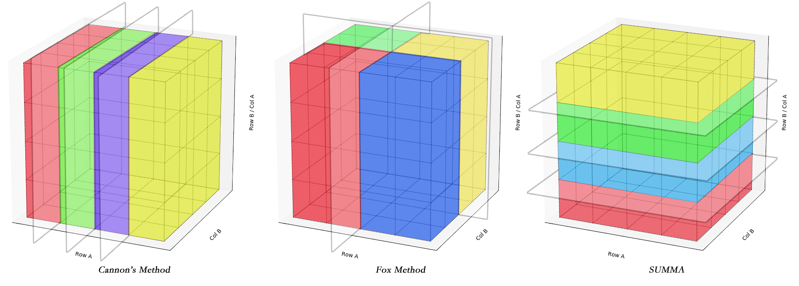
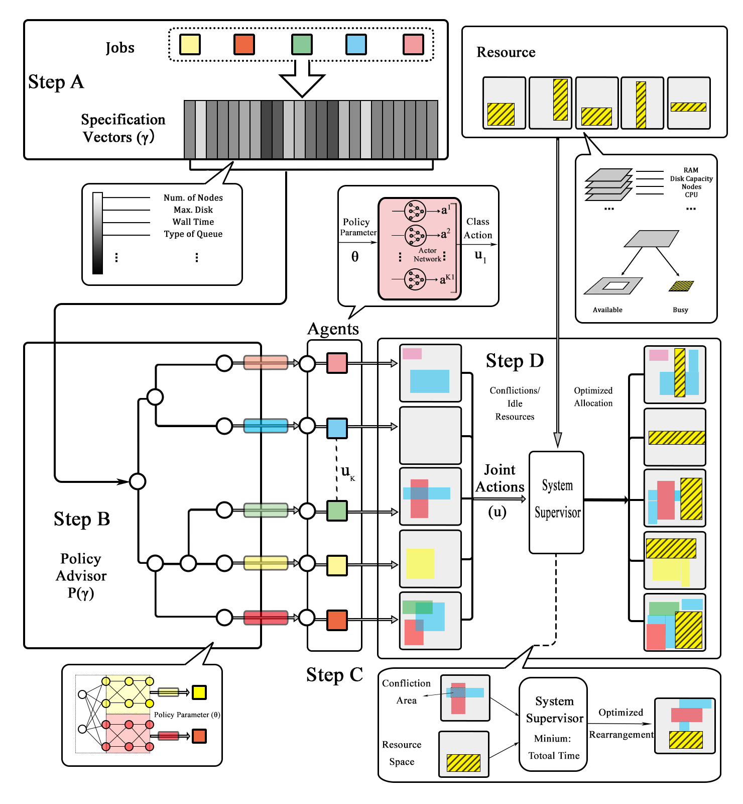

Welcome !

### Portfolio

<table class="wide">
<tr>
  <td class="left">
    
  </td>
  
  
  <td class="right">
    
  </td>
<!--
</tr>
<tr>
  <td class="left">
    
  </td>
  <td class="right">
    
  </td>
-->

</tr>
</table>

<!--

  

      <ul class="nav">
          <li><a href="https://bsharvey.github.io">see more figures</a></li>
      </ul>
  

-->
