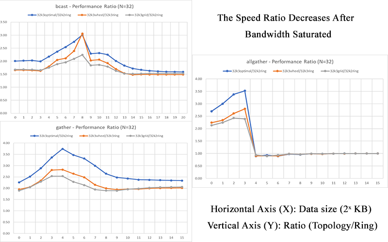

## Welcome to Lihua (Neo) Pei's Portfolio!

 
 

 My name is Lihua (Neo) Pei. Currently I am a graduate student studying at the George Washington University majored in Data Analytics.

I am enthusiastic about researches and studies which related to statistics, data analytics, and machine learning.

There are something you can explore me:

<ul>
      <li><a href="https://LihuaPeiNeo.github.io/Resume/Lihua_resume.pdf">Resume</a></li>
      <li><a href="https://github.com/LihuaPeiNeo">github</a></li>

</ul>

I attended the graduate research projects guided by professor Deng which aimed to search the optimal topologies for clusters.

As the second author, I am working on Parallel Matrix Multiplication Research paper which proposed an algorithmic group that covers Cannon’s. BMR, SUMMA, distributed Strassen’s method for scalable parallel large-scale matrix multiplications.

If you are interesting about my projects, please be free to click the pictures blow to enter my project introductions.

 

### Projects

<table class="wide">
<tr>
  <td class="left">
    
  </td>

  <td class="right">
    
  </td>

</tr>
<tr>
  <td class="left">
    
  </td>
  <td class="right">
    
  </td>

</tr>
</table>

<!--

  

      <ul class="nav">
          <li><a href="https://bsharvey.github.io">see more figures</a></li>
      </ul>
  

-->
