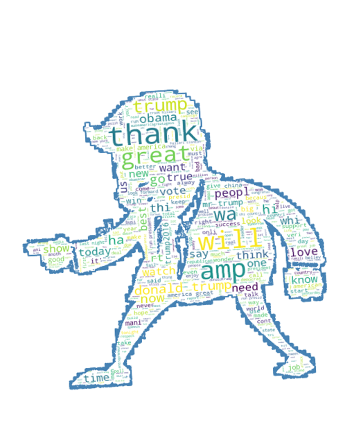

## Welcome to Lihua (Neo) Pei's Portfolio!

 
 

My name is Lihua (Neo) Pei. Currently I am a graduate student studying at the George Washington University majored in Data Analytics.

I describe myself as a junior data scientist with 2+ years of experience in work and projects.
Skilled in Machine Learning, Data Visualiztion, Nature Language Processing and Database Management.

 

###  Selected Projects

<table class="wide">
<tr>

  <td class="left">
    <a href="https://LihuaPeiNeo.github.io/Fresh_Air_DC/README.md">
      
      <h5>Fresh Air DC Project</h5>
    </a>
  </td>
  
  <td class="left">
    <a href="https://LihuaPeiNeo.github.io/Matrix_Paper/PMM_Represent">
      
      <h5>Parallel Matrix Mutiplication</h5>
    </a>
  </td>

  <td class="right">
    <a href="https://github.com/LihuaPeiNeo/LihuaPeiNeo.github.io/blob/master/final_project/Trump.pdf">
        
        <h5>Topic Modeling - Donald Trump's Twitters Analysis</h5>
    </a>
  </td>

</tr>
<tr>
  <td class="left">
    <a href="https://LihuaPeiNeo.github.io/Topology/Topology_Repersent">
        
        <h5>Optimal Topology Searching Research</h5>
    </a>
  </td>
  <td class="right">
    <a href="https://LihuaPeiNeo.github.io/Scheduling_Process/SP_Represent">
        
        <h5>Scheduling Process</h5>
    </a>
    
  </td>

</tr>
</table>

<!--

  

      <ul class="nav">
          <li><a href="https://bsharvey.github.io">see more figures</a></li>
      </ul>
  

-->
